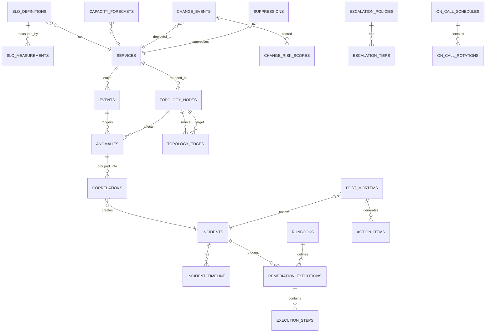

# Data Architecture -- Sovereign AIOps Platform

**Module:** ERP-AIOps | **Port:** 5179 | **Version:** 2.0 | **Date:** 2026-03-03

---

## 1. Entity Relationship Diagram

---

## 2. Full Data Dictionary

### 2.1 events

Core telemetry events ingested from all monitoring sources.

| Column | Type | Constraints | Description |
|---|---|---|---|
| id | UUID | PK, DEFAULT gen_random_uuid() | Unique event identifier |
| tenant_id | TEXT | NOT NULL, INDEX | Tenant isolation key |
| source | TEXT | NOT NULL | Origin system (prometheus, datadog, cloudwatch, custom) |
| source_event_id | TEXT | | Original event ID from source system |
| event_type | TEXT | NOT NULL, CHECK IN (metric, log, trace, change, security) | Classification |
| severity | TEXT | NOT NULL, CHECK IN (info, warning, critical, fatal) | Severity level |
| service_id | UUID | FK -> services(id) | Associated service |
| environment | TEXT | NOT NULL | Environment (production, staging, development) |
| region | TEXT | | Cloud region or data center |
| message | TEXT | NOT NULL | Human-readable event description |
| labels | JSONB | DEFAULT '{}' | Key-value labels (pod, namespace, host) |
| metrics | JSONB | | Numeric metric values |
| raw_payload | JSONB | | Original payload from source |
| fingerprint | TEXT | NOT NULL, INDEX | Content hash for deduplication |
| ingested_at | TIMESTAMPTZ | NOT NULL, DEFAULT now() | Platform ingestion time |
| event_timestamp | TIMESTAMPTZ | NOT NULL, INDEX | Actual event occurrence time |
| processed | BOOLEAN | DEFAULT false | Whether anomaly detection has run |

**Partitioning:** Range by event_timestamp (daily). Retention: 30 days.

### 2.2 anomalies

Detected anomalies from ML models.

| Column | Type | Constraints | Description |
|---|---|---|---|
| id | UUID | PK | Unique anomaly identifier |
| tenant_id | TEXT | NOT NULL, INDEX | Tenant isolation key |
| event_id | UUID | FK -> events(id) | Triggering event |
| service_id | UUID | FK -> services(id) | Affected service |
| detection_model | TEXT | NOT NULL | Model used (isolation_forest, lstm, drain, rule_based) |
| anomaly_type | TEXT | NOT NULL | Type (point, temporal, log_novel, threshold) |
| confidence_score | DECIMAL(4,3) | NOT NULL, CHECK 0-1 | ML confidence score |
| features | JSONB | NOT NULL | Feature values used in detection |
| explanation | JSONB | | SHAP values or human explanation |
| metric_name | TEXT | | For metric anomalies: which metric |
| metric_value | DOUBLE PRECISION | | Anomalous value |
| baseline_mean | DOUBLE PRECISION | | Expected value |
| baseline_stddev | DOUBLE PRECISION | | Expected variation |
| is_suppressed | BOOLEAN | DEFAULT false | Matched suppression rule |
| suppression_reason | TEXT | | Suppression reason |
| correlation_id | UUID | FK -> correlations(id) | Correlation group |
| detected_at | TIMESTAMPTZ | NOT NULL, DEFAULT now() | Detection time |

**Partitioning:** Range by detected_at (daily). Retention: 90 days.

### 2.3 incidents

Actionable incidents from correlated anomalies.

| Column | Type | Constraints | Description |
|---|---|---|---|
| id | UUID | PK | Incident identifier |
| tenant_id | TEXT | NOT NULL, INDEX | Tenant isolation key |
| title | TEXT | NOT NULL | Auto-generated title |
| description | TEXT | | Detailed description |
| severity | TEXT | NOT NULL | info, warning, critical, fatal |
| status | TEXT | NOT NULL | open, acknowledged, investigating, mitigating, resolved, closed |
| root_cause_service_id | UUID | FK -> services(id) | Identified root cause service |
| root_cause_confidence | DECIMAL(4,3) | | Root cause confidence |
| root_cause_explanation | TEXT | | Human-readable reasoning |
| blast_radius | JSONB | | Affected services with impact type |
| correlation_method | TEXT | | temporal, topological, bayesian |
| assigned_to | TEXT | | Assigned on-call engineer |
| escalation_level | INTEGER | DEFAULT 0 | Current escalation tier |
| acknowledged_at | TIMESTAMPTZ | | First acknowledgment |
| resolved_at | TIMESTAMPTZ | | Resolution time |
| resolution_summary | TEXT | | How resolved |
| resolution_type | TEXT | | auto_remediated, manual, self_healed, false_positive |
| ttd_seconds | INTEGER | | Time to detect |
| ttr_seconds | INTEGER | | Time to resolve |
| created_at | TIMESTAMPTZ | NOT NULL, DEFAULT now() | Creation time |
| updated_at | TIMESTAMPTZ | NOT NULL, DEFAULT now() | Last update |

### 2.4 correlations

Groups of related events forming a single incident.

| Column | Type | Constraints | Description |
|---|---|---|---|
| id | UUID | PK | Correlation group ID |
| tenant_id | TEXT | NOT NULL | Tenant isolation |
| incident_id | UUID | FK -> incidents(id) | Resulting incident |
| correlation_type | TEXT | NOT NULL | temporal, topological, bayesian, manual |
| window_start | TIMESTAMPTZ | NOT NULL | Correlation window start |
| window_end | TIMESTAMPTZ | NOT NULL | Correlation window end |
| event_count | INTEGER | NOT NULL | Events in group |
| anomaly_count | INTEGER | NOT NULL | Anomalies in group |
| services_affected | TEXT[] | | Affected service names |
| confidence | DECIMAL(4,3) | | Correlation confidence |
| reasoning | JSONB | | Detailed reasoning |
| created_at | TIMESTAMPTZ | NOT NULL, DEFAULT now() | |

### 2.5 runbooks

Automated remediation playbooks.

| Column | Type | Constraints | Description |
|---|---|---|---|
| id | UUID | PK | Runbook identifier |
| tenant_id | TEXT | NOT NULL | Tenant isolation |
| name | TEXT | NOT NULL | Runbook name |
| description | TEXT | | What this runbook does |
| version | INTEGER | NOT NULL, DEFAULT 1 | Immutable version |
| trigger_conditions | JSONB | NOT NULL | Matching conditions |
| steps | JSONB | NOT NULL | Ordered execution steps (DSL) |
| guardrails | JSONB | NOT NULL | Safety constraints |
| mode | TEXT | NOT NULL | observe, suggest, approve, autonomous |
| applicable_services | TEXT[] | | Service patterns (null = all) |
| applicable_severities | TEXT[] | | Severity levels |
| cooldown_seconds | INTEGER | DEFAULT 1800 | Min time between executions |
| success_rate | DECIMAL(4,3) | | Historical success rate |
| avg_execution_time_s | INTEGER | | Average duration |
| embedding | vector(1536) | | Semantic embedding for matching |
| is_active | BOOLEAN | DEFAULT true | Whether enabled |
| created_by | TEXT | NOT NULL | Author |
| created_at | TIMESTAMPTZ | NOT NULL, DEFAULT now() | |
| updated_at | TIMESTAMPTZ | NOT NULL, DEFAULT now() | |

### 2.6 remediation_executions

Records of runbook execution attempts.

| Column | Type | Constraints | Description |
|---|---|---|---|
| id | UUID | PK | Execution identifier |
| tenant_id | TEXT | NOT NULL | Tenant isolation |
| incident_id | UUID | NOT NULL, FK -> incidents(id) | Triggering incident |
| runbook_id | UUID | NOT NULL, FK -> runbooks(id) | Runbook executed |
| runbook_version | INTEGER | NOT NULL | Version at execution time |
| status | TEXT | NOT NULL | pending_approval, approved, running, verifying, completed, failed, rolled_back, aborted |
| mode | TEXT | NOT NULL | Execution mode used |
| approved_by | TEXT | | Approver (null if autonomous) |
| approved_at | TIMESTAMPTZ | | Approval time |
| started_at | TIMESTAMPTZ | | Execution start |
| completed_at | TIMESTAMPTZ | | Execution end |
| duration_seconds | INTEGER | | Total time |
| steps_completed | INTEGER | DEFAULT 0 | Steps done |
| steps_total | INTEGER | NOT NULL | Total steps |
| output | JSONB | | Combined output |
| error_message | TEXT | | Error details |
| rolled_back | BOOLEAN | DEFAULT false | Rollback triggered |
| rollback_reason | TEXT | | Rollback reason |
| health_check_passed | BOOLEAN | | Post-execution health result |

### 2.7 topology_nodes

Service instances in the dependency graph.

| Column | Type | Constraints | Description |
|---|---|---|---|
| id | UUID | PK | Node identifier |
| tenant_id | TEXT | NOT NULL | Tenant isolation |
| service_name | TEXT | NOT NULL | Service name |
| service_type | TEXT | NOT NULL | microservice, database, cache, queue, gateway, external |
| environment | TEXT | NOT NULL | Environment |
| namespace | TEXT | | Kubernetes namespace |
| cluster | TEXT | | Kubernetes cluster |
| discovery_source | TEXT | NOT NULL | kubernetes, istio, cloud_api, manual |
| metadata | JSONB | DEFAULT '{}' | Additional properties |
| health_status | TEXT | DEFAULT 'unknown' | healthy, degraded, unhealthy, unknown |
| last_seen | TIMESTAMPTZ | NOT NULL, DEFAULT now() | Last discovery confirmation |
| created_at | TIMESTAMPTZ | NOT NULL, DEFAULT now() | |

**Unique:** (tenant_id, service_name, environment)

### 2.8 topology_edges

Directed dependencies between services.

| Column | Type | Constraints | Description |
|---|---|---|---|
| id | UUID | PK | Edge identifier |
| tenant_id | TEXT | NOT NULL | Tenant isolation |
| source_node_id | UUID | NOT NULL, FK -> topology_nodes(id) | Calling service |
| target_node_id | UUID | NOT NULL, FK -> topology_nodes(id) | Called service |
| edge_type | TEXT | NOT NULL | sync_http, sync_grpc, async_kafka, async_sqs, database, cache, storage |
| protocol | TEXT | | Specific protocol |
| latency_p50_ms | DOUBLE PRECISION | | Median latency |
| latency_p99_ms | DOUBLE PRECISION | | p99 latency |
| error_rate | DOUBLE PRECISION | | Error rate |
| requests_per_second | DOUBLE PRECISION | | Throughput |
| discovery_source | TEXT | NOT NULL | How discovered |
| last_seen | TIMESTAMPTZ | NOT NULL, DEFAULT now() | Last observation |
| created_at | TIMESTAMPTZ | NOT NULL, DEFAULT now() | |

### 2.9 slo_definitions

SLO targets defined by users.

| Column | Type | Constraints | Description |
|---|---|---|---|
| id | UUID | PK | SLO identifier |
| tenant_id | TEXT | NOT NULL | Tenant isolation |
| service_id | UUID | NOT NULL, FK -> services(id) | Target service |
| name | TEXT | NOT NULL | SLO name |
| sli_type | TEXT | NOT NULL | availability, latency_p99, error_rate, throughput |
| target | DECIMAL(6,4) | NOT NULL | Target (e.g., 0.9990) |
| threshold_value | DOUBLE PRECISION | | Latency threshold in ms |
| window_days | INTEGER | NOT NULL, DEFAULT 30 | Rolling window |
| burn_rate_alerts | JSONB | | Multi-window alert config |
| error_budget_minutes | DOUBLE PRECISION | GENERATED | (1-target) * window_days * 24 * 60 |
| is_active | BOOLEAN | DEFAULT true | Active tracking |
| created_by | TEXT | NOT NULL | |
| created_at | TIMESTAMPTZ | NOT NULL, DEFAULT now() | |

### 2.10 slo_measurements

Time-series SLI measurements (TimescaleDB hypertable).

| Column | Type | Constraints | Description |
|---|---|---|---|
| id | UUID | PK | Measurement ID |
| tenant_id | TEXT | NOT NULL | Tenant isolation |
| slo_id | UUID | NOT NULL, FK -> slo_definitions(id) | Which SLO |
| measurement_time | TIMESTAMPTZ | NOT NULL | Bucket timestamp |
| good_events | BIGINT | NOT NULL | Good events in bucket |
| total_events | BIGINT | NOT NULL | Total events in bucket |
| sli_value | DECIMAL(8,6) | NOT NULL | Computed SLI |
| error_budget_consumed | DECIMAL(8,6) | | Cumulative budget consumed |
| burn_rate | DECIMAL(8,4) | | Current burn rate |

**Storage:** 1-minute buckets. Retention: 13 months.

### 2.11 capacity_forecasts

ML-generated resource utilization forecasts.

| Column | Type | Constraints | Description |
|---|---|---|---|
| id | UUID | PK | Forecast ID |
| tenant_id | TEXT | NOT NULL | Tenant isolation |
| service_id | UUID | NOT NULL, FK -> services(id) | Target service |
| resource_type | TEXT | NOT NULL | cpu, memory, disk, network, connections |
| forecast_generated_at | TIMESTAMPTZ | NOT NULL | Generation time |
| forecast_horizon_hours | INTEGER | NOT NULL | Horizon (72, 720, 2160) |
| forecast_data | JSONB | NOT NULL | Array of {timestamp, predicted, lower, upper} |
| exhaustion_predicted | BOOLEAN | DEFAULT false | Threshold breach predicted |
| exhaustion_timestamp | TIMESTAMPTZ | | Predicted exhaustion time |
| exhaustion_confidence | DECIMAL(4,3) | | Prediction confidence |
| recommended_action | TEXT | | Scaling recommendation |
| model_version | TEXT | NOT NULL | ML model version |
| model_accuracy_mae | DOUBLE PRECISION | | Recent MAE |

### 2.12 change_events

Deployment and configuration change events.

| Column | Type | Constraints | Description |
|---|---|---|---|
| id | UUID | PK | Change event ID |
| tenant_id | TEXT | NOT NULL | Tenant isolation |
| service_id | UUID | FK -> services(id) | Changed service |
| change_type | TEXT | NOT NULL | deployment, config_change, scaling, rollback, feature_flag |
| source | TEXT | NOT NULL | github, gitlab, argocd, manual |
| commit_sha | TEXT | | Git commit SHA |
| description | TEXT | | Change description |
| changed_by | TEXT | | Who made the change |
| files_changed | INTEGER | | Files changed count |
| lines_added | INTEGER | | LOC added |
| lines_removed | INTEGER | | LOC removed |
| environment | TEXT | NOT NULL | Target environment |
| started_at | TIMESTAMPTZ | NOT NULL | Change start |
| completed_at | TIMESTAMPTZ | | Change completion |
| status | TEXT | | in_progress, completed, failed, rolled_back |
| caused_incident | BOOLEAN | DEFAULT false | Caused an incident |
| incident_id | UUID | FK -> incidents(id) | Related incident |

### 2.13 suppressions

Active alert suppression rules.

| Column | Type | Constraints | Description |
|---|---|---|---|
| id | UUID | PK | Suppression rule ID |
| tenant_id | TEXT | NOT NULL | Tenant isolation |
| name | TEXT | NOT NULL | Rule name |
| reason | TEXT | NOT NULL | maintenance, known_issue, deployment |
| match_conditions | JSONB | NOT NULL | {service, severity, message_pattern, labels} |
| starts_at | TIMESTAMPTZ | NOT NULL | Start time |
| ends_at | TIMESTAMPTZ | NOT NULL | Expiration time |
| created_by | TEXT | NOT NULL | Creator |
| events_suppressed | BIGINT | DEFAULT 0 | Suppressed count |
| is_active | BOOLEAN | DEFAULT true | Currently active |
| created_at | TIMESTAMPTZ | NOT NULL, DEFAULT now() | |

### 2.14 escalation_policies

Incident notification escalation rules.

| Column | Type | Constraints | Description |
|---|---|---|---|
| id | UUID | PK | Policy ID |
| tenant_id | TEXT | NOT NULL | Tenant isolation |
| name | TEXT | NOT NULL | Policy name |
| description | TEXT | | Description |
| service_pattern | TEXT | | Service glob pattern |
| severity_filter | TEXT[] | | Severity triggers |
| tiers | JSONB | NOT NULL | Array of {level, delay_minutes, targets} |
| is_default | BOOLEAN | DEFAULT false | Default policy |
| created_at | TIMESTAMPTZ | NOT NULL, DEFAULT now() | |

### 2.15 on_call_schedules

On-call rotation schedules.

| Column | Type | Constraints | Description |
|---|---|---|---|
| id | UUID | PK | Schedule ID |
| tenant_id | TEXT | NOT NULL | Tenant isolation |
| name | TEXT | NOT NULL | Schedule name |
| timezone | TEXT | NOT NULL | Timezone |
| escalation_policy_id | UUID | FK -> escalation_policies(id) | Linked policy |
| rotation_type | TEXT | NOT NULL | daily, weekly, custom |
| participants | JSONB | NOT NULL | [{user_id, name, contact_methods}] |
| overrides | JSONB | DEFAULT '[]' | Temporary overrides |
| handoff_time | TIME | NOT NULL | Daily handoff time |
| created_at | TIMESTAMPTZ | NOT NULL, DEFAULT now() | |

### 2.16 services (reference)

| Column | Type | Constraints | Description |
|---|---|---|---|
| id | UUID | PK | Service ID |
| tenant_id | TEXT | NOT NULL | Tenant isolation |
| name | TEXT | NOT NULL | Service name |
| tier | TEXT | NOT NULL | critical, standard, best_effort |
| team | TEXT | | Owning team |
| slack_channel | TEXT | | Team channel |
| repository_url | TEXT | | Git repo URL |
| description | TEXT | | Description |
| created_at | TIMESTAMPTZ | NOT NULL, DEFAULT now() | |

### 2.17 post_mortems

| Column | Type | Constraints | Description |
|---|---|---|---|
| id | UUID | PK | Post-mortem ID |
| tenant_id | TEXT | NOT NULL | Tenant isolation |
| incident_id | UUID | NOT NULL, FK -> incidents(id) | Related incident |
| title | TEXT | NOT NULL | Title |
| summary | TEXT | | Executive summary |
| timeline | JSONB | | Auto-generated timeline |
| root_cause_analysis | TEXT | | Detailed RCA |
| contributing_factors | JSONB | | Contributing factors |
| lessons_learned | TEXT | | Key takeaways |
| status | TEXT | | draft, review, published |
| author | TEXT | NOT NULL | Primary author |
| reviewers | TEXT[] | | Assigned reviewers |
| published_at | TIMESTAMPTZ | | Publication time |
| created_at | TIMESTAMPTZ | NOT NULL, DEFAULT now() | |

### 2.18 action_items

| Column | Type | Constraints | Description |
|---|---|---|---|
| id | UUID | PK | Action item ID |
| tenant_id | TEXT | NOT NULL | Tenant isolation |
| post_mortem_id | UUID | NOT NULL, FK -> post_mortems(id) | Source post-mortem |
| title | TEXT | NOT NULL | Title |
| description | TEXT | | Details |
| priority | TEXT | NOT NULL | p0, p1, p2, p3 |
| assigned_to | TEXT | | Owner |
| due_date | DATE | | Due date |
| status | TEXT | NOT NULL | open, in_progress, completed, wont_fix |
| completed_at | TIMESTAMPTZ | | Completion time |
| created_at | TIMESTAMPTZ | NOT NULL, DEFAULT now() | |

---

## 3. Data Flow Summary

| Source | Destination | Volume | Retention |
|---|---|---|---|
| External monitoring | events (PostgreSQL) | 100K/sec | 30 days |
| Events | anomalies | ~5K/sec (5% rate) | 90 days |
| Anomalies | incidents | ~100/day | Indefinite |
| Incidents | remediation_executions | ~60/day | Indefinite |
| Kubernetes | topology_nodes/edges | ~1K nodes | Current + 30d |
| SLI data | slo_measurements | ~10K/min | 13 months |
| Resource metrics | capacity_forecasts | ~500/day | 90 days |

---

## 4. Data Security & Compliance

| Requirement | Implementation |
|---|---|
| Tenant isolation | All tables include tenant_id; Hasura row-level security |
| PII redaction | Log events pass through PII detector before storage |
| Encryption at rest | PostgreSQL TDE with AES-256 |
| Encryption in transit | TLS 1.3 for all connections |
| Audit immutability | remediation_audit_log: no UPDATE/DELETE grants |
| Data retention | Automated partition drop via pg_partman |
| Right to deletion | PII fields can be anonymized independently |

---

*Document Control: Schema changes require migration review and backward compatibility assessment.*
