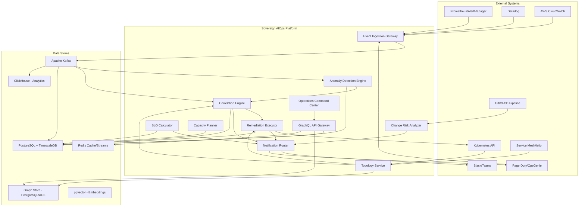
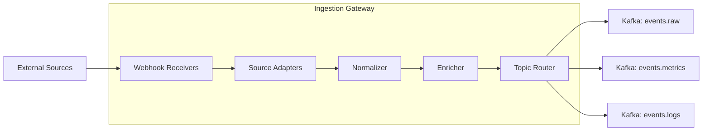
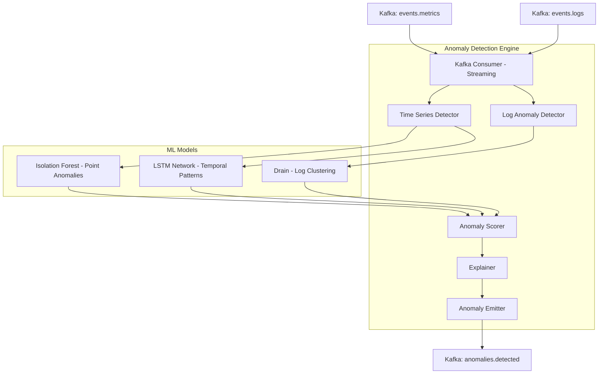
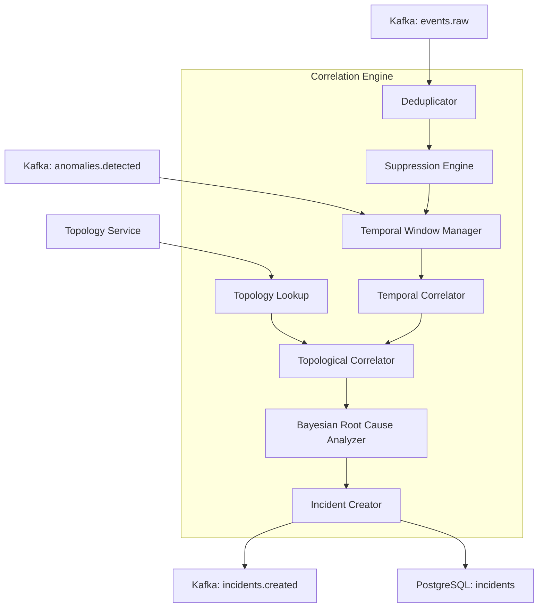
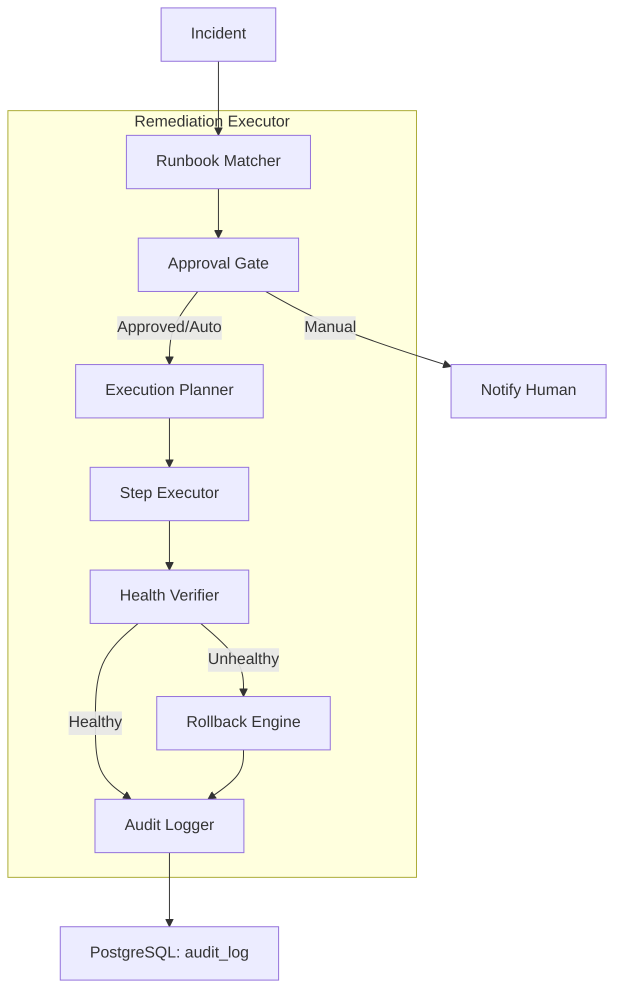
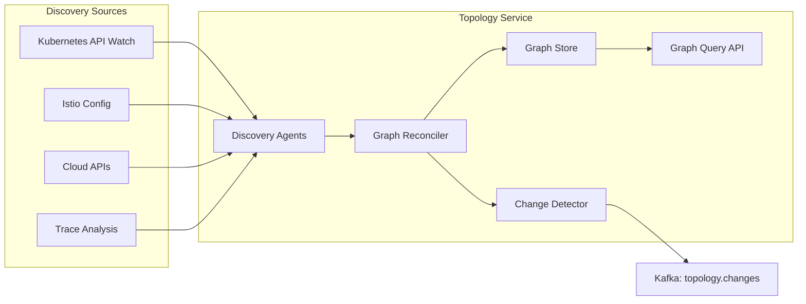
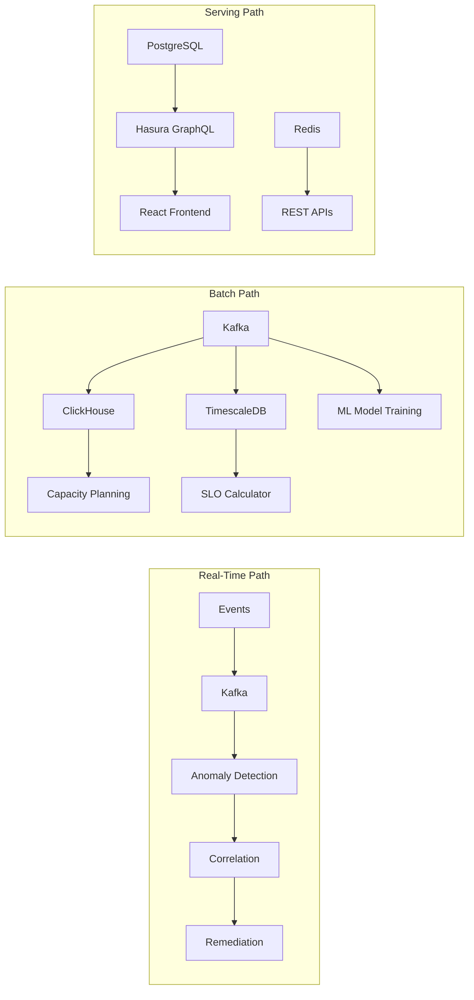
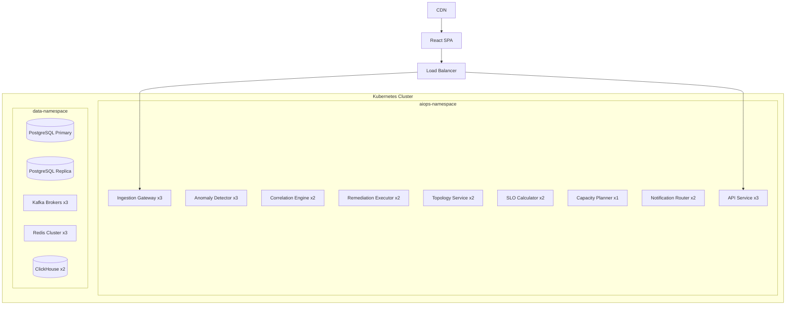

# High-Level Design (HLD) -- Sovereign AIOps Platform

**Module:** ERP-AIOps | **Port:** 5179 | **Version:** 2.0 | **Date:** 2026-03-03

---

## 1. Architecture Overview

Sovereign AIOps follows an event-driven, microservices architecture with dedicated ML inference pipelines. The system operates on a lambda architecture: a streaming path for real-time anomaly detection and correlation, and a batch path for model training, capacity forecasting, and reporting.

### 1.1 Design Principles

1. **Integration-first** -- Works alongside existing monitoring tools, never replaces them
2. **Progressive autonomy** -- Observe -> suggest -> approve -> autonomous (earn trust incrementally)
3. **Topology-aware** -- Every decision (correlation, remediation, blast radius) leverages the dependency graph
4. **Immutable audit trail** -- Every system action is logged and cannot be modified
5. **Graceful degradation** -- If ML inference is slow, fall back to rule-based detection; never drop events
6. **Tenant isolation** -- All data paths enforce `tenant_id` isolation at the query and storage layer

---

## 2. System Context Diagram

---

## 3. Component Architecture

### 3.1 Event Ingestion Gateway

**Purpose:** Unified entry point for all telemetry sources. Normalizes events into Common Event Format (CEF).

- **Source Adapters:** Protocol-specific handlers (Prometheus webhook, Datadog API, CloudWatch Events, custom HTTP)
- **Normalizer:** Maps source-specific fields to CEF schema
- **Enricher:** Adds metadata: tenant_id, service ownership (from topology), environment, region
- **Topic Router:** Routes to appropriate Kafka topic based on event type (metric, log, trace, change)

**Scale:** 100K events/second sustained. Horizontal scaling via Kafka consumer groups.

### 3.2 Anomaly Detection Engine

**Purpose:** Streaming ML inference to detect anomalies in metrics and logs in real time.

- **Isolation Forest:** Point anomaly detection for individual metric values. O(n log n) training, O(log n) inference
- **LSTM Network:** Sequential anomaly detection for temporal patterns (gradual degradation). Sliding window of 60 data points
- **Drain Algorithm:** Log template extraction and clustering. Novel log patterns flagged as anomalies
- **Anomaly Scorer:** Combines model outputs into unified confidence score (0.0-1.0)
- **Explainer:** SHAP values for feature attribution -- which metrics/features drove the anomaly classification

**Latency Target:** <30 seconds from event ingestion to anomaly emission.

### 3.3 Correlation Engine

**Purpose:** Groups related anomalies and events into actionable incidents using temporal, topological, and causal reasoning.

- **Temporal Correlator:** Groups events within configurable time windows (default 5 min) sharing attributes
- **Topological Correlator:** Traverses dependency graph upstream to find root cause service
- **Bayesian Root Cause:** Assigns probability P(root_cause | observed_symptoms) using historical incident patterns
- **Deduplicator:** Content-hash deduplication of identical alerts within a window
- **Suppression Engine:** Filters events matching active maintenance windows or suppression rules

### 3.4 Remediation Executor

**Purpose:** Executes automated runbooks with safety guardrails, approval gates, and automatic rollback.

### 3.5 Topology Service

**Purpose:** Maintains real-time service dependency graph via auto-discovery.

- **Graph Store:** Apache AGE (PostgreSQL graph extension) for efficient traversal queries
- **Refresh Interval:** Every 5 minutes, with watch-based real-time updates for Kubernetes
- **Edge Types:** sync (HTTP/gRPC), async (Kafka/SQS), database, cache, storage

### 3.6 SLO Calculator

- Ingests SLI measurements from events pipeline
- Calculates rolling window compliance (7d, 30d, 90d)
- Computes burn rate: burn_rate = error_rate / (1 - SLO_target) * window_hours
- Multi-window alerting: 1h (14.4x burn = page), 6h (6x burn = ticket), 3d (1x burn = review)
- Writes to TimescaleDB for time-series analysis and trending

### 3.7 Capacity Planner

- **Training:** Daily batch job on 90+ days of utilization data per resource per service
- **Models:** Facebook Prophet for seasonality + XGBoost for event-driven spikes
- **Forecast Horizon:** 72 hours (primary), 30 days (planning), 90 days (budget)
- **Recommendations:** Right-size (current), scale-up (imminent exhaustion), scale-down (over-provisioned)

### 3.8 Notification Router

- **Channels:** Slack, Microsoft Teams, PagerDuty, OpsGenie, email, webhook
- **Routing Logic:** Severity -> escalation policy -> on-call schedule -> channel preference
- **Dedup:** No duplicate notifications for the same incident within a configurable window
- **Escalation:** Auto-escalate if no acknowledgment within SLA (default: 10 min for P1)

---

## 4. Data Flow Architecture

---

## 5. Infrastructure Architecture

| Component | Technology | Scaling Model |
|---|---|---|
| Event Bus | Apache Kafka (3+ brokers) | Horizontal (partitions) |
| Primary Database | PostgreSQL 16 + TimescaleDB | Vertical + read replicas |
| Graph Database | Apache AGE (PostgreSQL extension) | Vertical |
| Analytics Database | ClickHouse | Horizontal (sharding) |
| Vector Store | pgvector (PostgreSQL extension) | Vertical |
| Cache | Redis Cluster | Horizontal (sharding) |
| ML Inference | Go services + ONNX Runtime | Horizontal (replicas) |
| API Gateway | Hasura GraphQL Engine | Horizontal (replicas) |
| Frontend | React + Vite + Refine.dev | CDN-distributed |
| Service Runtime | Kubernetes (EKS/GKE/AKS) | Cluster autoscaler |

---

## 6. Security Architecture

### 6.1 Authentication & Authorization
- **Authentication:** JWT tokens via ERP-Auth module (OAuth 2.0 / OIDC)
- **Authorization:** RBAC with roles: Viewer, Operator, Admin, Super Admin
- **Tenant Isolation:** All queries filtered by `tenant_id` at Hasura permission layer

### 6.2 Data Security
- **At Rest:** AES-256 encryption (PostgreSQL TDE, encrypted EBS/PD volumes)
- **In Transit:** TLS 1.3 for all service-to-service communication
- **PII Handling:** Auto-redaction of PII patterns in log events before storage
- **Secrets:** HashiCorp Vault for runbook credentials, rotated every 24 hours

---

## 7. Deployment Architecture

---

## 8. Integration Points

| System | Integration Method | Direction | Purpose |
|---|---|---|---|
| Prometheus/AlertManager | Webhook receiver | Inbound | Metric alerts |
| Datadog | API polling + webhook | Inbound | Metrics, logs, traces |
| CloudWatch | EventBridge subscription | Inbound | AWS resource events |
| PagerDuty | Bidirectional API | Both | Incident sync, on-call |
| Kubernetes | API server watch | Both | Discovery + remediation |
| Istio/Envoy | xDS API | Inbound | Service mesh topology |
| Slack/Teams | Bot API | Outbound | Notifications, approvals |
| Git/CI-CD | Webhook | Inbound | Deployment events |
| Hasura | GraphQL Federation | Both | API gateway |
| ERP modules | Hasura remote schemas | Both | Cross-module data |

---

*Document Control: Architecture decisions recorded in ADR format. Changes require Architecture Review Board approval.*
